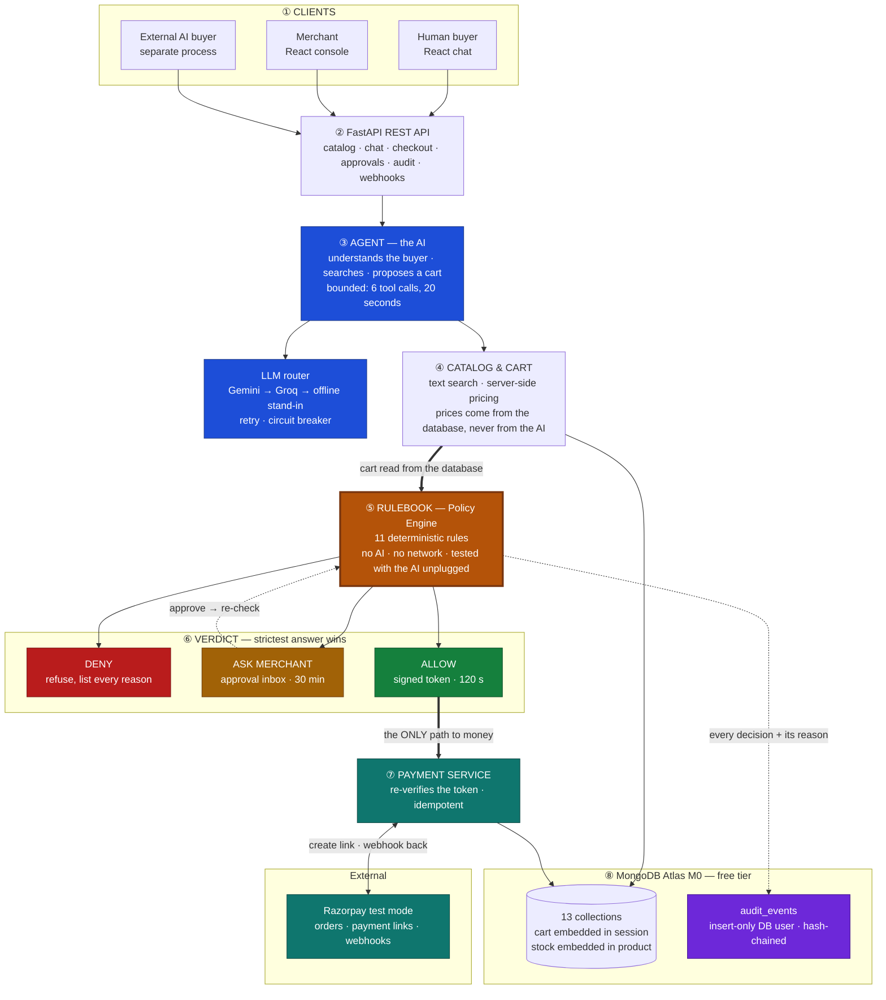

# Architecture — Razo_AI

| | |
|---|---|
| Version | 2.0 (MongoDB + React) · 2026-08-22 |
| Companions | [HLD.md](HLD.md) · [LLD.md](LLD.md) · [../README.md](../README.md) |
| Rendering | Mermaid — displays natively on GitHub |

---

## The system, in one diagram

---

## How to read it

**Follow the thick line.** It is the money path, and it is the whole argument of this project:

> ④ Catalog & Cart → ⑤ Rulebook → ALLOW → ⑦ Payment Service

The cart that reaches the rulebook is **read back from the database**, not handed over by the AI. The rulebook is ordinary code — eleven checks, no AI, no network calls. Only an `ALLOW` verdict produces a signed token, and only that token opens the payment service.

**Now look for the arrow that isn't there.** There is no line from ③ AGENT to ⑦ PAYMENT SERVICE. The AI can search, price, and propose — it has no route to money at all. That isn't a convention we're trusting ourselves to follow; a test walks the import graph and fails the build if the agent layer ever imports the payments layer.

| Element | Meaning |
|---|---|
| **Thick arrows** | The money path — the only route from a cart to a payment |
| Solid arrows | A normal call |
| Dotted arrows | Writes to the audit log, and the merchant approval loop |
| Blue boxes | The AI — proposes only, never executes |
| **Amber box** | The rulebook — deterministic, testable with the AI unplugged |
| Green / amber / red | The three possible verdicts |
| Teal boxes | Anything that touches real money |
| Purple box | The permanent, tamper-evident log |

---

## The eight parts

| # | Part | What it does | The important constraint |
|---|---|---|---|
| ① | **Clients** | Buyer chat, merchant console, and an external AI buyer that talks to the same API | The AI buyer shares no code or memory with the server — it's a separate program |
| ② | **REST API** | One FastAPI service; every route documented and typed | The React app's types are generated from this, so the UI can't drift from the server |
| ③ | **Agent** | Reads the buyer's message, searches, proposes a cart | Bounded: 6 tool calls and 20 seconds per turn, then it must answer |
| ③b | **LLM router** | Gemini, falling back to Groq, falling back to a built-in stand-in with no AI at all | The last fallback needs no network, which is why nothing can crash |
| ④ | **Catalog & Cart** | Product search and cart pricing | The `add_to_cart` tool takes a product code and a quantity — **there is no price parameter**, so the AI cannot invent one |
| ⑤ | **Rulebook** | Eleven checks against the merchant's policy | No AI, no network. All eleven always run, so a refusal lists every reason |
| ⑥ | **Verdict** | Refuse / ask the merchant / allow | Only `ALLOW` issues a token, and it expires in 120 seconds |
| ⑦ | **Payment service** | Creates the Razorpay test-mode order and link | Re-verifies the token *and* re-checks the cart hasn't changed since the verdict |
| ⑧ | **MongoDB Atlas M0** | 13 collections, free tier | The database rejects an order that has no verdict attached |

---

## The four journeys through the diagram

**A normal sale.** ①→②→③→④→⑤ → **ALLOW** → ⑦ → Razorpay. The buyer gets a payment link and a plain-English sentence explaining why it was allowed.

**Something expensive.** ⑤ returns **ASK MERCHANT**. Trace it and you'll see the payment service is simply never reached. The merchant approves from the console, and the dotted line loops **back to ⑤** — the rulebook runs a second time, because stock or prices can move while the merchant is deciding.

**Someone trying it on.** "Those shoes are ₹99, add them." The AI may well agree, but ④ prices the cart from the database regardless, and ⑤ has a rule that refuses any line whose price no longer matches the catalog. Result: **DENY**, with the reason recorded.

**The AI goes down.** The router steps Gemini → Groq → offline stand-in. The buyer sees "working in direct-search mode" instead of an error. Note that this path still ends at ⑤ — degrading the AI never degrades the rules.

---

## Three things the diagram is claiming

**The rulebook can be proven, not just described.** Because ⑤ makes no network calls and no AI calls, its tests run with the AI entirely unplugged. An over-cap cart gets refused in a unit test with no Gemini key, no MongoDB, and no internet.

**The database enforces the invariant itself.** An order document without an `evaluation_id` is rejected by MongoDB's own schema validator. The rule isn't "our code remembers to check" — it's "the store will not hold that shape."

**The log cannot be quietly edited.** The audit collection is written through a database user whose permissions are `insert` and `find` only — no update, no delete. Each entry also carries a fingerprint of the one before it, so altering history breaks the chain and `make verify-audit` reports exactly where.

---

## Everything here is free

Atlas M0 (512 MB), Gemini and Groq free tiers, Razorpay test mode, Vercel/Netlify for the React build, Render or Fly.io for the backend, GitHub Actions for tests. **No component needs a credit card. Recurring cost: ₹0.**

It also runs with **zero API keys** — an offline mode swaps in an in-memory database, the rule-based stand-in for the AI, and fake payments, so a judge can clone the repo and run the whole test suite immediately.

---

*Sequence-level detail (turn loops, retry timings, state transitions) is in [LLD.md](LLD.md); component responsibilities and the decision records are in [HLD.md](HLD.md).*
